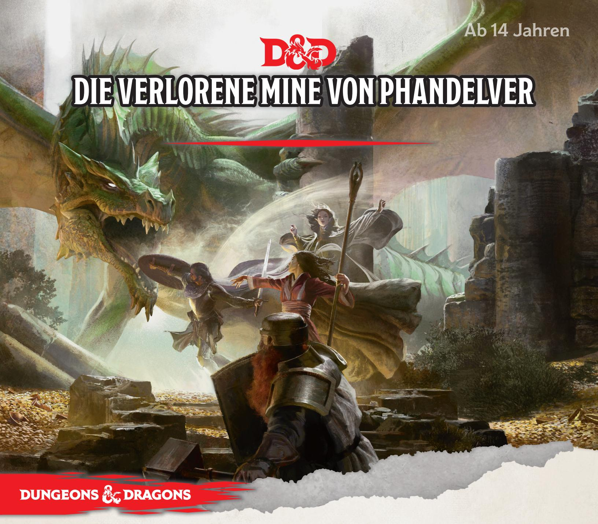
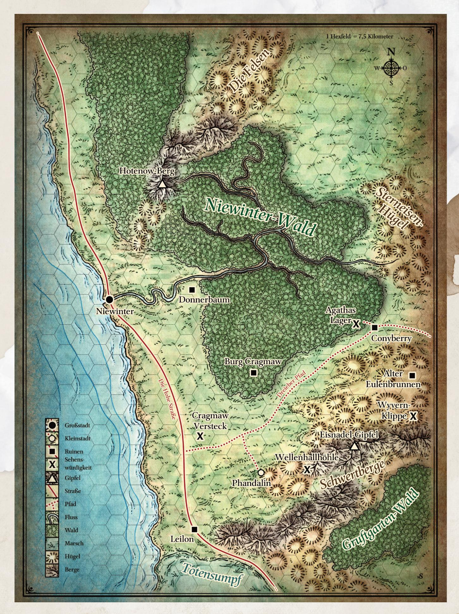
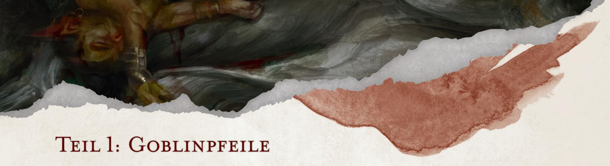
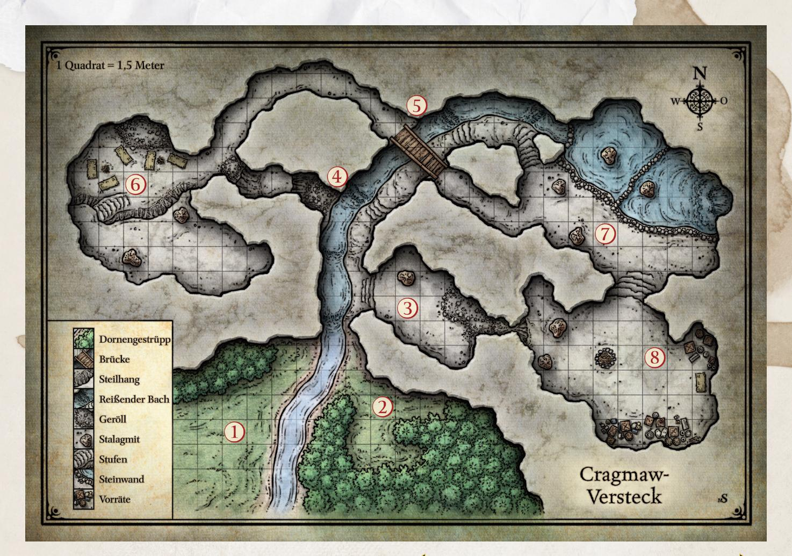
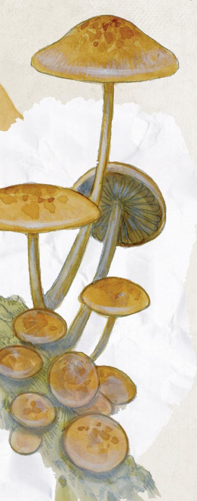
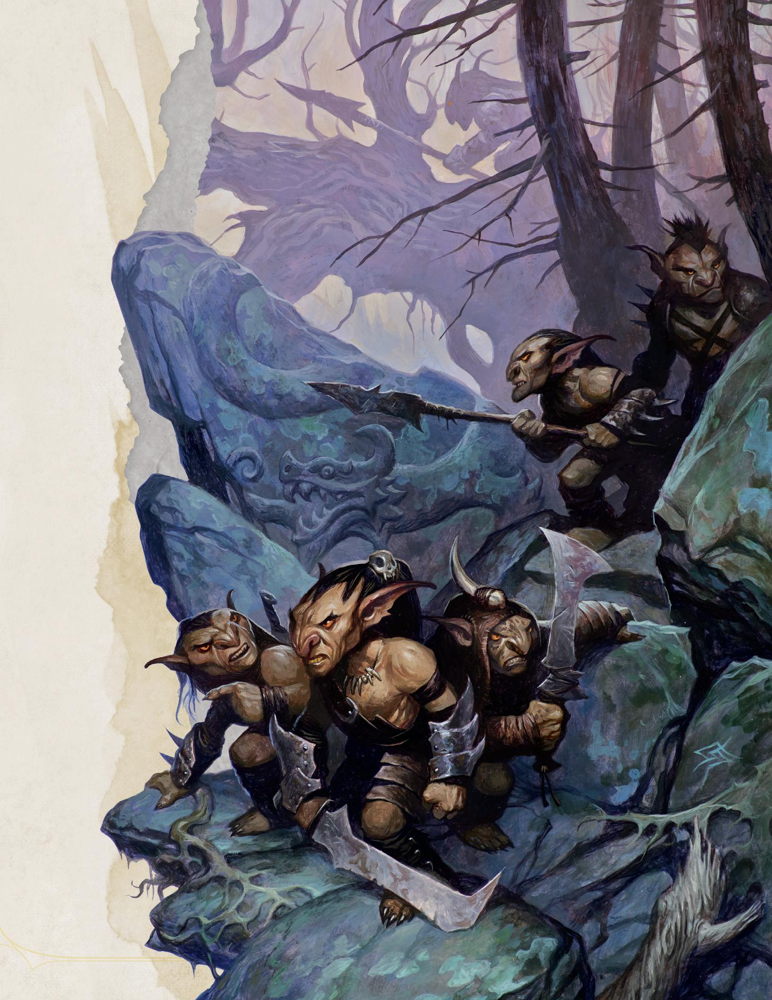

## Inhaltsverzeichnis

| EINFÜHRUNG                  | 2  |
|-----------------------------|----|
| Das Abenteuer leiten        | 2  |
| Hintergrund                 |    |
| Übersicht                   |    |
| Abenteueraufhänger          |    |
| Die Vergessenen Reiche      |    |
| Teil 1: Goblinpfeile        |    |
| Goblin-Hinterhalt           |    |
| Cragmaw-Versteck            |    |
| Teil 2: Phandalin           |    |
| Begegnungen in Phandalin    | 14 |
| Wichtige NSC                |    |
| Beschreibung der Stadt      |    |
| Rotbrenner-Schläger         |    |
| Rotbrenner-Versteck         |    |
| Teil 3: Das Netz der Spinne | 27 |
| Dreieber-Pfad               | 27 |
|                             |    |

| Conyberry und Agathas Behausung    | 28 |
|------------------------------------|----|
| Alter Eulenbrunnen                 |    |
| Ruinen von Donnerbaum              |    |
| Wyvernkuppe                        |    |
| Burg Cragmaw                       |    |
| Teil 4: Wellenhallhöhle            |    |
| Charakterstufe                     | 42 |
| Erfahrungspunkte als Belohnung     | 42 |
| Wandernde Monster                  |    |
| Allgemeine Merkmale                | 42 |
| Abgestimmte Begegnungen            |    |
| Abschluss                          |    |
| ANHANG A: MAGISCHE GEGENSTÄNDE     |    |
| Einsatz von magischen Gegenständen | 52 |
| Beschreibung von Gegenständen      |    |
| Anhang B: Monster                  |    |
| Spielwerte                         |    |
| Monsterbeschreibung                |    |
| Index                              |    |
|                                    |    |

# Einführung

Dieses Buch ist für den Spielleiter geschrieben. Es beinhaltet ein vollständiges Abenteuer für Dungeons & Dragons sowie die Beschreibungen aller Kreaturen und magischer Gegenstände, die in diesem Abenteuer zu finden sind. Es bietet auch eine Einführung in die Welt der Vergessenen Reiche, eine der langlebigsten Spielwelten des Spiels, und zeigt dir, wie du ein D&D-Spiel leiten kannst.

Das kleinere Büchlein, das dieses hier begleitet (von jetzt an "Regelbuch" genannt), beschreibt die Regeln, die du brauchst, um Situationen zu meistern, die während des Abenteuers eintreten können.

## Das Abenteuer leiten

*Die Verlorene Mine von Phandelver* ist ein Abenteuer für vier bis fünf Charaktere der 1. Stufe. Während des Abenteuers werden die Charaktere die 5. Stufe erreichen. Das Abenteuer spielt in kurzer Entfernung zur Stadt Niewinter in der Region der Schwertküste in den Vergessenen Reichen. Die Schwertküste ist ein Teil des Nordens dieser Welt - eines gewaltigen Reichs freier Siedlungen, das von Wildnis und Abenteuern umgeben ist.

Du musst kein Experte der Vergessenen Reiche sein, um dieses Abenteuer zu leiten; alles was du über die Spielwelt wissen musst ist in diesem Buch enthalten.

Wenn dies das erste Mal ist, dass du ein D&D-Abenteuer leitest, lies den Abschnitt "Der Spielleiter"; er wird dir dabei helfen, deine Rolle und deine Aufgaben besser zu verstehen.

Der Abschnitt "Hintergrund" beschreibt alles, was du wissen musst, um das Abenteuer vorzubereiten. Der Abschnitt "Übersicht" beschreibt, wie das Abenteuer vermutlich laufen wird und gibt dir ein allgemeines Gefühl dafür, was die Spielercharaktere zu jedem Zeitpunkt tun sollten.

## Der Spielleiter

Der Spielleiter (SL) hat eine besondere Rolle bei einer Spielsitzung Dungeons & Dragons.

Der SL ist der **Schiedsrichter**. Wenn nicht klar ist, was als nächstes passieren soll, dann entscheidet der SL wie die Regeln gedeutet werden sollen und sorgt dafür, dass die Geschichte weiter läuft.

Der SL ist auch der **Erzähler**. Er bestimmt den Rhythmus der Geschichte und präsentiert die verschiedenen Herausforderungen und Begegnungen, die die Spieler überwinden müssen. Der SL ist die Schnittstelle der Spieler zur Welt von D&D, sowie derjenige, der das Abenteuer liest (und manchmal selbst schreibt) und den Spielern schildert, was als Reaktion auf die Aktionen der Charaktere passiert.

Der SL **verkörpert die Monster** und Bösewichte, gegen die sich die Abenteurer behaupten müssen. Er wählt die Aktionen der Monster aus und würfelt für ihre Angriffe. Der SL spielt auch die Rolle aller anderen Charaktere, die die Spieler im Laufe ihres Abenteuers treffen, wie die Gefangenen in der Goblinbehausung oder den Wirt in der Stadt.

Wer soll der SL für eure Spielgruppe sein? Wer auch immer es sein möchte! Die Person, die den meisten Antrieb hat, eine Gruppe aufzubauen und das Spiel zu beginnen, wird oft fast automatisch der SL, aber das muss nicht der Fall sein. Auch wenn der SL die Monster und Bösewichte in diesem Abenteuer kontrolliert, ist die

Beziehung zwischen den Spielern und dem SL nicht feindselig. Es ist die Aufgabe des SL, die Charaktere mit interessanten Begegnungen und Herausforderungen zu konfrontieren, das Spiel am Laufen zu halten und die Regeln gerecht anzuwenden.

Das Wichtigste, was du im Kopf behalten solltest, wenn du ein guter SL sein willst, ist, dass die Regeln nur ein Werkzeug sind, das euch dabei helfen sollen, Spaß zu haben. Die Regeln haben nicht das Sagen. Du bist der SL – du hast die Kontrolle über das Spiel. Leite die Spielerfahrung und den Einsatz der Regeln an, sodass alle Spaß haben können.

Viele Spieler in Dungeons & Dragons sind der Ansicht, dass der beste Teil des Spiels ist, der SL zu sein. Mit den Informationen in diesem Abenteuer wirst du bereit sein, diese Rolle für deine Gruppe zu übernehmen.

#### **Regeln für das Spiel**

Als Spielleiter bist du die letzte Autorität, wenn es um Regelfragen und Meinungsverschiedenheiten während des Spiels geht. Hier hast du einige Richtlinien, die dir helfen können, Probleme zu lösen, die vielleicht entstehen können.

 **Wenn du dir nicht sicher bist, erfinde es!** Es ist besser, das Spiel am Laufen zu halten, als sich von den Regeln ausbremsen zu lassen.

**Es ist kein Wettkampf.** Der SL steht nicht im Wettstreit mit den Spielern und ihren Spielercharakteren. Du bist da, um die Monster zu leiten, die Regeln zu verwalten und die Geschichte in Gang zu halten.

**Es ist eine gemeinsame Geschichte**. Es ist die Geschichte der Gruppe, lass also die Spieler das Endergebnis durch die Aktionen ihrer Charaktere beeinflussen. In Dungeons & Dragons geht es um Vorstellungskraft und das gemeinsame Erzählen einer Geschichte als Gruppe. Lass die Spieler am Erzählen der Geschichte teilhaben.

**Sei beständig.** Wenn du in einer Sitzung entschieden hast, dass die Regeln auf eine bestimmte Weise funktionieren, dann achte darauf, dass sie genauso funktionieren, wenn es im Spiel das nächste Mal Thema wird.

**Achte darauf, dass alle dabei sind.** Gib jedem Charakter die Gelegenheit zu glänzen. Wenn einige Spieler nicht von sich aus sprechen wollen, vergiss nicht sie zu fragen, was ihre Charaktere tun.

*Sei fair.* Verwende deine Macht als Spielleiter nur zum Guten. Behandle die Regeln und die Spieler auf unparteiische Weise.

**Pass auf.** Achte darauf, dass du dich gelegentlich am Tisch umsiehst, um festzustellen, ob das Spiel gut läuft. Wenn alle Spaß zu haben scheinen, dann entspanne dich und mach weiter. Wenn der Spaß abnimmt, könnte es Zeit für eine Pause sein, oder du musst die Sache ein wenig auflockern.

## Attributswürfe improvisieren

Das Abenteuer gibt dir oft vor, welche Attributswürfe Charaktere in verschiedenen Situationen versuchen könnten, sowie den Schwierigkeitsgrad (SG) dieser Würfe. Manchmal werden Abenteurer Dinge versuchen, die das Abenteuer einfach nicht vorhersehen kann. Du kannst entscheiden, ob ihre Versuche erfolgreich sind oder nicht. Wenn du der Meinung bist, dass die beschriebene Handlung jedem leicht fallen sollte, dann ist kein Attributswurf notwendig; beschreibe dem Spieler einfach, was passiert. Wenn es keine Chance gibt, dass jemand eine solche Aufgabe vollenden könnte, dann sag dem Spieler, dass es nicht funktioniert.

Ansonsten kannst du dich an diesen drei einfachen Fragen orientieren:

- Welche Art von Attributswurf ist nötig?
- Wie schwierig ist er?
- Was ist das Ergebnis?

Verwende die Beschreibung der Attributswerte und ihrer zugehörigen Fertigkeiten im Regelbuch, um zu entscheiden, welches Attribut du verwenden solltest. Dann bestimme, wie schwierig die Aufgabe ist, damit du den SG für den Wurf festlegen kannst. Je höher der SG, umso schwieriger ist die Aufgabe. Die einfachste Art, einen SG festzulegen, ist zu entscheiden, ob die Aufgabe einfach, mittelschwer oder schwer ist und dann die folgenden SG zu verwenden:

- **Einfach (SG 10).** Eine einfache Aufgabe erfordert ein Mindestmaß an Können oder ein bisschen Glück, um erfolgreich zu sein.
- **Mittelschwer (SG 15).** Eine mittelschwere Aufgabe erfordert ein bisschen mehr Geschick, damit man sie vollenden kann. Ein Charakter mit einer Kombination aus natürlicher Begabung und spezialisierter Ausbildung wird eine mittelschwere Aufgabe meistens erfolgreich abschließen.
- **Schwer (SG 20).** Schwere Aufgaben sind alle Anstrengungen, welche die Möglichkeiten der meisten Leute ohne Unterstützung oder besonderes Können übersteigen. Selbst mit Können und Ausbildung wird ein Charakter Glück — oder viel spezialisiertes Training — brauchen, um eine schwere Aufgabe zu bestehen.

Das Ergebnis eines erfolgreichen Wurfs ist normalerweise leicht zu bestimmen: der Charakter ist mit dem, was er vorhatte, erfolgreich, im Rahmen der Vernunft. Es ist normalerweise auch nicht schwer, herauszufinden, was bei einem misslungenen Wurf passiert: der Charakter ist einfach nicht erfolgreich.

## Glossar

Das Abenteuer verwendet einige Begriffe, die dir vielleicht noch nicht vertraut sind. Einige dieser Begriffe sind hier beschrieben. Die Beschreibung von Regelbegriffen findest du im Regelbuch.

**Charaktere.** Dieser Begriff beschreibt die Abenteurer, die deine Spieler lenken. Sie sind die Protagonisten eines jeden D&D-Abenteuers. Eine Gruppe von Charakteren wird als *Abenteurergruppe* bezeichnet.

**Nichtspielercharakter (NSC).** Dieser Begriff beschreibt die Charaktere, die der SL lenkt. Wie sich ein NSC verhält, entscheidet das Abenteuer und der SL.

**Textkasten.** An verschiedenen Stellen präsentiert das Abenteuer beschreibenden Text, der den Spielern vorgelesen oder umschrieben werden sollte. Dieser Text zum Vorlesen ist in Kästen dargestellt. Textkästen werden vor allem verwendet, um Räume zu beschreiben oder vorgeschriebene Dialoge zu präsentieren.

**Spielwerte.** Alle Monster oder NSC, die wahrscheinlich in Kampfsituationen verwickelt werden, brauchen *Spielwerte*, damit der SL sie effektiv nutzen kann. Diese Spielwerte sind in Kästen zusammengefasst. Du findest die Spielwerte, die für dieses Abenteuer notwendig sind, in Anhang B.

**Zehntag.** In den Vergessenen Reichen ist eine Woche zehn Tage lang und wird *Zehntag* genannt. Jeder Monat besteht aus drei Zehntagen, also aus insgesamt 30 Tagen.

## Magische Gegenstände und Monster

Immer wenn der Text sich namentlich auf einen magischen Gegenstand bezieht, dann wird der Name *kursiv* gedruckt. Eine Beschreibung der Gegenstände und ihrer magischen Eigenschaften findest du in Anhang A.

Wenn das Abenteuer den Namen einer Kreatur **fett** gedruckt präsentiert, dann bedeutet das, dass du die Spielwerte der Kreatur in Anhang B finden kannst.

## Abkürzungen

Die folgenden Abkürzungen werden im Lauf dieses Abenteuers verwendet.

SG = Schwierigkeitsgrad GM = Goldmünze(n) SM = Silbermünze(n) KM = Kupfermünze(n) EP = Erfahrungspunkte PM = Platinmünze(n) EM = Elektrummünze(n)

## Hintergrund

Vor mehr als fünfhundert Jahren schlossen Klans der Zwerge und Gnome ein Abkommen, das als Phandelvers Pakt bekannt ist, als sie eine reiche Mine in einer wundersamen Höhle teilen sollten, die als Wellenhallhöhle bekannt ist. Neben dem mineralischen Reichtum barg die Mine auch große magische Macht. Menschliche Zauberwirker verbündeten sich mit den Zwergen und Gnomen, um diese Energie zu kanalisieren und in eine große Schmiede zu binden (genannt Zauberschmiede), mit der magische Gegenstände erschaffen werden konnten. Die Zeiten waren gut, und die nahe menschliche Stadt Phandalin gedieh ebenfalls.

Aber dann kam es zu einer schrecklichen Katastrophe, als Orks durch den Norden zogen und alles in ihrem Weg in Schutt und Asche legten. Eine mächtige Streitmacht von Orks, die von bösen gedungenen Magiern unterstützt wurde, griff die Wellenhallhöhle an, um ihre Reichtümer und magischen Schätze zu erbeuten. Menschliche Magier kämpften Seite an Seite mit ihren zwergischen und gnomischen Verbündeten, um die Zauberschmiede zu verteidigen. Der resultierende magische Kampf verwüstete einen großen Teil der Höhle und nur Wenige überlebten die Einstürze und Beben, und der Standort der Wellenhallhöhle geriet in Vergessenheit.

Jahrhunderte lang haben Gerüchte über begrabene Schätze Schatzsucher und Glücksritter in die Gegend um Phandalin gelockt, aber niemandem ist es jemals gelungen, die verschollene Mine ausfindig zu machen und nun hat in den vergangenen Jahren die Wiederbesiedelung der Gegend begonnen.

Phandalin ist jetzt eine wilde Grenzstadt, und was noch wichtiger ist, die Felssucher-Brüder —drei Zwerge — haben den Eingang zur verschollenen Wellenhallhöhle entdeckt und wollen die Mine wieder öffnen. Unglücklicherweise sind die Felssucher nicht die einzigen, die an der Wellenhallhöhle interessiert sind. Ein geheimnisvoller Bösewicht, der als die Schwarze Spinne bekannt ist, kontrolliert ein Netzwerk von Banditenbanden und Goblins in der Gegend, und seine Agenten haben die Felssucher bis zu ihrem Fund verfolgt. Jetzt will die Schwarze Spinne die Wellenhallhöhle für sich und dabei sicherstellen, dass niemand sonst weiß, wo sie zu finden ist.

## Übersicht

*Die Verlorene Mine von Phandelver* ist in vier Teile gegliedert. In Teil 1, "Goblinpfeile", befinden sich die Abenteurer auf der Straße zur Stadt Phandalin, als sie in einen Goblin-Hinterhalt geraten. Sie stellen fest, dass die Goblins (die zum Cragmaw-Stamm gehören) ihren Zwergenfreund Gundren Felssucher und seinen Begleiter, einen menschlichen Krieger namens Sildar Hallwinter, entführt haben. Die Charaktere müssen den Hinterhalt überleben und dann die Goblins zurück zu ihrem Versteck verfolgen. Sie retten Sildar und erfahren von ihm, dass Gundren und seine Brüder eine berühmte verschollene Mine entdeckt haben. Sildar weiß nur, dass Gundren und seine Karte an einen Ort gebracht worden sind, der "Burg Cragmaw" genannt wird.

In Teil 2, "Phandalin", treffen die Charaktere in Phandalin ein und stellen fest, dass es von den Rotbrennern terrorisiert wird, einer Bande von Übeltätern, die von einer geheimnisvollen Gestalt namens Glasstab angeführt wird. In Phandalin können die Charaktere auch einige interessante NSC antreffen, was Aufhänger für kurze Abenteuer in Teil 3 liefert. Die Rotbrenner versuchen, die Charaktere aus der Stadt zu vertreiben, also zahlen ihnen es die Charaktere mit gleicher Münze zurück und stürmen den Rotbrenner-Unterschlupf. In deren, unter einem alten Anwesen verborgenen, Festung finden sie heraus, dass Iarno "Glasstab" Albrek, der Anführer der Rotbrenner, seine Befehle von jemandem erhält, der nur die Schwarze Spinne genannt wird – und dass die Schwarze Spinne die Abenteurer aus dem Weg räumen will.

Teil 3, "Das Netz der Spinne", bietet den Charakteren mehrere kurze Abenteuer in der Region um Phandalin, während sie nach mehr Informationen über die Schwarze Spinne und die verlorene Mine der Zwerge suchen. Die Hinweise, die die Charaktere in Phandalin entdeckt haben, können dazu führen, dass sie einen geheimnisvollen Magier in den Ruinen des Alten Eulenbrunnens erspähen, die Ratschläge einer gefährlichen Todesfee suchen, eine Bande von Orks unschädlich machen, die an der Wyvernkuppe kampieren, und die Ruinen der Stadt Donnerbaum erkunden.

Mehrere dieser Hinweise führen zu Burg Cragmaw, der Festung von König Grol, dem Anführer der Cragmaw-Goblins. Hier erfahren die Charaktere, dass die Schwarze Spinne ein Drow-Abenteurer namens Nezznar ist, und dass die Cragmaw-Goblins für ihn arbeiten (Drow sind Elfen, die aus einem Reich tief unter der Erde stammen). Was noch wichtiger ist, sie finden Gundren Felssuchers Karte zur verschollenen Mine oder finden den Standort der Mine in einem der anderen Hinweise, die sie während Teil 3 gefunden haben.

Wenn sie der Karte oder der Wegbeschreibung zur verlorenen Mine folgen, bringt das die Charaktere in Teil 4 in die "Wellenhallhöhle". Dieser verschollene unterirdische Komplex ist jetzt von Untoten und seltsamen Monstern überrannt worden. Nezznar die Schwarze Spinne hat sich hier mit seinen loyalen Anhängern verschanzt, erkundet die Minen und sucht nach der legendären Zauberschmiede. Die Abenteurer haben die Gelegenheit, Gundren Felssucher zu rächen, den Wohlstand und die Sicherheit von Phandalin zu sichern, indem sie die reiche Mine von Monstern befreien, und den Untoten der Schwarzen Spinne ein Ende setzen – wenn sie die Gefahren der Verlorenen Mine von Phandelver überleben können.

## Abenteueraufhänger

Du kannst die Spieler ihre eigenen Gründe erfinden lassen, warum sie Phandalin besuchen, oder du verwendest die folgenden Abenteueraufhänger. Die Hintergründe und sekundären Ziele auf dem Charakterblatt bieten Charakteren auch Motivationen, Phandalin besuchen zu wollen.

*Trefft mich in Phandalin.* Die Charaktere befinden sich in der Stadt Niewinter, wenn ihr zwergischer Gönner und Freund, Gundren Felssucher, sie anwirbt, um einen Wagen nach Phandalin zu begleiten. Gundren ist mit einem Krieger, Sildar Hallwinter, vorgereist, um sich um seine Geschäfte in der Stadt zu kümmern, während die Charaktere mit den Vorräten folgen. Die Charaktere erhalten jeweils 10 GM vom Besitzer von Barthens Vorräte in Phandalin, wenn sie den Wagen sicher zum Handelsposten liefern.

## Die Vergessenen Reiche

Wie in einem Fantasyroman oder Film findet das Abenteuer in einer größeren Welt statt. Tatsächlich kann die Welt alles sein, was sich SL und Spieler vorstellen können. Es könnte sich um eine Swords-and-Sorcery-Welt am Anbeginn der Zivilisation handeln, in der Barbaren gegen böse Zauberer kämpfen, oder eine postapokalyptische Fantasywelt, in der Elfen und Zwerge zwischen den zerstörten Ruinen einer technologischen Zivilisation Zauber wirken. Die meisten D&D-Welten liegen irgendwo zwischen diesen Extremen: Es sind Welten der mittelalterlichen High-Fantasy mit

Rittern und Burgen, sowie elfischen Städten, Zwergenminen und fürchterlichen Monstern.

Die Welt der Vergessenen Reiche ist eine solche Spielwelt, und hier findet die Geschichte dieses Abenteuers statt. In den Reichen wagen sich Ritter in die Grüfte des gefallenen Zwergenkönigs von Delzoun, wo sie Ruhm und Schätze suchen. Schurken streifen durch die dunklen Gassen übervölkerter Städte wie Niewinter und Baldurs Tor. Kleriker im Dienste der Götter führen Streitkolben und Zauber und ziehen auf Abenteuer gegen die schrecklichen Mächte aus, die das Land bedrohen. Magier plündern die Ruinen des gefallenen Netheresischen Imperiums und decken Geheimnisse auf, die zu dunkel für das Licht des Tages ist. Drachen, Riesen, Dämonen und unvorstellbare Gräuel lauern in Kerkern, Höhlen, Ruinenstädten und der gewaltigen Wildnis der Welt.

Auf den Straßen und Flüssen der Reiche reisen Spielleute und Hausierer, Kaufleute und Wachen, Soldaten, Seeleute und Abenteurer mit stählernem Herzen, die Geschichten von seltsamen, wunderbaren, weit entfernten Orten erzählen. Gute Karten und klare Straßen können einen unerfahrenen Jüngling mit Träumen des Ruhms weit durch die ganze Welt führen. Tausende von rastlosen Möchtegern-Helden von Bauernhöfen aus dem Hinterland und schläfrigen Dörfern treffen jedes Jahr in Niewinter und den anderen großen Städten ein, auf der Suche nach Reichtum und Anerkennung.

Bekannte Straßen sind vielleicht vielbefahren, aber sicher sind sie nicht unbedingt. Dunkle Magie, tödliche Monster und grausame lokale Herrscher sind die Gefahren, mit denen du es zu tun bekommst, wenn du durch die Vergessenen Reiche reist. Selbst Bauernhöfe und Anwesen, die nur eine Tagesreise von einer Stadt entfernt sind, können Opfer von Monstern werden, und kein Ort ist sicher vor dem plötzlichen Zorn eines Drachen.

Die regionale Karte zeigt nur einen sehr kleinen Teil dieser gewaltigen Welt, einen Teil der Region, die Schwertküste genannt wird. Dies ist eine Region der Abenteuer, wo wagemutige Seelen in die Ruinen uralter Festungen eindringen und die Überreste lange verlorener Kulturen erkunden. In der Wildnis aus zerklüfteten, schneebedeckten Gipfeln, Gebirgswäldern, Gesetzlosen und Monstern birgt die Küstenregion auch die größten Bastionen der Zivilisation, darunter auch die Küstenstadt Niewinter.

#### **Rollenspiel und Inspiration**

Eines der Dinge, die du als SL tun kannst, ist es, Spieler dafür zu belohnen, wenn sie ihre Charaktere gut spielen.

Jeder Charakter in diesem Set hat zwei Persönlichkeitsmerkmale (ein positives und ein negatives), ein Ideal, eine Bindung und einen Makel. Diese Elemente können den Charakter leichter und spaßiger zu spielen machen. **Persönlichkeitsmerkmale** bieten einen Blick auf die Vorlieben, Abneigungen, Errungenschaften, Ängste, Einstellungen und Manierismen des Charakters. Ein **Ideal** ist etwas, das der Charakter glaubt oder nach dem er mehr als alles andere strebt. Die **Bindung** eines Charakters ist eine Beziehung zu einer Person, einem Ort oder einem Ereignis in der Welt — jemand, der dem Charakter wichtig ist, ein Ort, mit dem er eine besondere Verbindung hat, oder ein geliebter Besitz. Ein **Makel** ist ein Merkmal, den jemand anders ausnutzen kann, um dem Charakter zu schaden oder der den Charakter dazu bringt, gegen seine Interessen zu handeln.

Wenn ein Spieler ein negatives Persönlichkeitsmerkmal ausspielt oder sich einem Nachteil aussetzt, der vom Ausspielen einer Bindung oder eines Makels entsteht, kannst du dem Charakter als Belohnung eine Inspiration verleihen. Der Charakter kann sie ausgeben, wenn sein Charakter einen Attributswurf, einen Angriffswurf oder einen Rettungswurf ablegt. Inspiration auszugeben verleiht dem Charakter einen Vorteil bei dem Wurf. Ein schlauer Spieler kann die Inspiration auch ausgeben, um einen Nachteil bei einem Wurf aufzuheben.

Ein Charakter kann nur eine Inspiration auf einmal haben.

Zu Beginn des Abenteuers eskortieren die Spielercharaktere einen Wagen voller Proviant und Vorräte von Niewinter nach Phandalin. Die Reise führt sie nach Süden entlang der Hohen Straße zum Dreieber-Pfad, der nach Osten führt (wie du es der Landkarte entnehmen kannst). Als sie eine halbe Tagesreise von Phandalin entfernt sind, geraten sie in Schwierigkeiten mit Goblin-Plünderern vom Cragmaw-Stamm.

Lies den Textkasten, wenn du so weit bist. Wenn du einen anderen Abenteueraufhänger verwendest, spring zum zweiten Absatz und passe die Details entsprechend an. Die Informationen über den Wagen kannst du dann ignorieren.

In der Stadt Niewinter hat euch ein Zwerg namens Gundren Felssucher gebeten, eine Wagenladung voller Vorräte zur rauen Siedlung Phandalin zu bringen, die einige Tagesreisen südöstlich der Stadt liegt. Gundren war eindeutig aufgeregt und mehr als nur ein bisschen geheimnistuerisch, was den Grund für die Reise anging. Er sagte nur, dass er und seine Brüder "etwas Großes" gefunden hätten, und dass sie euch jedem 10 Goldmünzen zahlen würden, wenn ihr seine Lieferung zu Barthens Vorräte bringt, einem Handelsposten in Phandalin. Er ritt dann auf einem Pferd vor, zusammen mit einem Krieger namens Sildar Hallwinter, der ihn begleitete. Er sagte, dass er früher eintreffen müsse, um sich "ums Geschäft zu kümmern".

Ihr seid die letzten paar Tage auf der Hohen Straße von Niewinter aus nach Süden gereist, und seid gerade östlich auf den Dreieber-Pfad abgebogen. Ihr hattet bislang keine Probleme, aber dieses Gebiet kann gefährlich sein. Banditen und Gesetzlose sind dafür bekannt, auf dem Pfad zu lauern.

Ehe ihr mit dem Abenteuer weitermacht, solltest du einige Minuten mit den folgenden Punkten verbringen:

- Ermutige die Spieler, einander ihre Charaktere vorzustellen, wenn sie es noch nicht getan haben.
- Frage die Spieler, wie ihrer Meinung nach ihre Charaktere ihren Zwergengönner Gundren Felssucher kennengelernt haben. Lass die Spieler ihre eigenen Geschichten erfinden. Wenn einem Spieler gar nichts einfällt, dann schlage etwas Einfaches vor. Beispielsweise könnte Gundren ein Freund aus der Kindheit sein, oder jemand, der den Spielercharakteren in einer Notlage geholfen hat. Diese Übung ist eine großartige Gelegenheit für die Spieler, zur Hintergrundgeschichte des Abenteuers beizutragen.
- Bitte die Spieler, dir die Marschreihenfolge der Abenteurergruppe zu geben und zu beschreiben, wie die Charaktere reisen. Wer ist vorne, und wer geht hinten? Wenn die Charaktere Gundrens Wagenladung voller Vorräte eskortieren, dann müssen einer oder zwei Charaktere den Wagen lenken. Der Rest der Charaktere kann auf dem Wagen mitfahren, daneben hergehen oder vorausreiten, wie es ihnen gefällt.

#### Den Wagen lenken

Jeder Charakter kann den Wagen lenken. Dazu sind keine besonderen Fertigkeiten notwendig. Zwei Ochsen ziehen den Wagen. Wenn niemand die Zügel hält, bleiben die Ochsen stehen wo sie sind.

Der Wagen ist voll beladen mit einer Auswahl von Bergbauausrüstung und Lebensmitteln. Dazu gehören ein Dutzend Säcke Mehl, mehrere Fässer voller gesalzenem Schweinefleisch, zwei Fässer starkes Bier, Schaufeln, Pickel und Brecheisen (jeweils ungefähr ein Dutzend) und fünf Laternen mit einem kleinen Fass Öl (mit einem Volumen von ungefähr 50 Fläschchen). Der Gesamtwert der Fracht beträgt 100 GM.

Wenn du bereit bist, fahre mit dem Abschnitt "Goblin-Hinterhalt" fort.

## Goblin-Hinterhalt

Lies zu Beginn der Begegnung den folgenden Textkasten vor:

Ihr seid mittlerweile seit einem halben Tag auf dem Dreieber-Pfad. Als ihr um eine Biegung kommt, seht ihr, dass ungefähr 15 Meter vor euch zwei tote Pferde auf dem Boden liegen und den Pfad blockieren. In jedem von ihnen stecken mehrere schwarzgefiederte Pfeile. Der Wald steht hier nahe am Pfad, mit einer steilen Böschung und dichtem Unterholz auf beiden Seiten.

Wenn ihr den Abenteueraufhänger "Trefft mich in Phandalin" verwendet, dann kann ein Charakter, der sich nähert, um die Pferde genauer zu untersuchen, feststellen dass sie Gundren Felssucher und Sildar Hallwinter gehörten. Sie sind seit ungefähr einem Tag tot, und es ist klar, dass die Pfeile die Pferde getötet haben. Wenn die Charaktere die Szenerie genauer untersuchen, lies den folgenden Text vor:

Die Satteltaschen wurden geplündert. In der Nähe findet ihr eine leere lederne Kartenhülle.

Vier **Goblins** verstecken sich in den Wäldern, zwei auf jeder Seite der Straße. Sie warten, bis sich jemand den Leichen nähert, um dann anzugreifen.

Das wird vermutlich eine der vielen Kampfbegegnungen in diesem Abenteuer sein. Dies sind die Schritte, denen du folgen solltest, um sie effektiv zu leiten.

- Schau dir die **Goblin**-Spielwerte in Anhang B an. Da die Goblins sich verstecken, musst du ihren Heimlichkeitsmodifikator kennen: +6.
- Finde heraus, ob jemand überrascht wird. Die Abenteurergruppe kann die Goblins nicht überraschen, aber die Goblins könnten einige oder alle Charaktere überrumpeln. Lege einen Wurf auf Geschicklichkeit (Heimlichkeit) ab: wirf einen W20 für sie alle, addiere ihren Heimlichkeitsmodifikator (+6) auf den Wurf, und vergleiche das Gesamtergebnis mit der passiven Weisheit (Wahrnehmung) der Charaktere. Ein Charakter,

- dessen Wert niedriger ist als das Gesamtergebnis der Goblins, wird überrascht und kann somit in seinem ersten Zug des Kampfes nichts tun (siehe "Überraschung" im Regelwerk).
- Verwende die Initiativeregeln aus dem Regelbuch, um herauszufinden, wer als erster, zweiter, dritter und so weiter handelt. Schreibe dir die Initiativewerte aller Beteiligten in der Randspalte dieses Buchs oder auf einem Blatt Papier auf.
- Wenn es an der Zeit ist, dass die Goblins handeln, stürmen die Hälfte der Goblins vor und führen Nahkampfangriffe aus, während die übrigen 9 Meter von der Abenteurergruppe entfernt stehenbleiben und Fernkampfangriffe ausführen. Die Spielwerte dieser Goblins beinhalten die Informationen, die du brauchst, um diese Angriffe abzuwickeln. Mehr Informationen zu den möglichen Aktionen für die Goblins in ihrem Zug findest du in Kapitel 2 des Regelbuchs, "Kampf".
- Wenn alle Goblins bis auf einen besiegt sind, versucht der letzte zu entkommen, wobei er in Richtung des Goblinpfads davon läuft.

#### Entwicklungen

In dem Fall, dass die Goblins die Abenteurer bezwingen, lassen sie sie bewusstlos zurück, plündern sie und den Wagen aus und kehren zum Cragmaw-Versteck zurück. Die Charaktere können weiter nach Phandalin reisen, neue Ausrüstung bei Barthens Vorräte kaufen, zur Stelle des Hinterhalts zurückkehren und den Goblinpfad finden.

Die Charaktere könnten einen oder mehrere Goblins gefangen nehmen, indem sie sie bewusstlos schlagen anstatt sie zu töten. Ein Charakter kann jede Nahkampfwaffe verwenden, um einen Goblin bewusstlos zu schlagen, wobei er erfolgreich ist, wenn der Angriff genug Schaden verursacht, um den Goblin auf 0 Trefferpunkte zu bringen. Sobald ein gefangener Goblin nach einigen Minuten wieder zu Bewusstsein kommt, kann er überzeugt werden, zu teilen, was er weiß (siehe den Kasten "Was die Goblins wissen" auf Seite 8). Ein Goblin könnte auch überzeugt werden, die Abenteurergruppe zum Cragmaw-Versteck zu bringen, was ihnen erlaubt, den Fallen auf dem Pfad aus dem Weg zu gehen (siehe den Abschnitt "Goblinpfad").

Die Charaktere könnten den Goblinpfad nicht finden oder sie könnten sich entscheiden, direkt nach Phandalin zu reisen. Mach in diesem Fall mit Teil 2, "Phandalin", weiter. Elmar Barthen (der Besitzer von Barthens Vorräte) wendet sich an die Charaktere und informiert sie, dass Gundren Felssucher niemals eingetroffen ist. Er berichtet von den Schwierigkeiten mit den Goblins und schlägt vor, dass die Charaktere zum Ort des Hinterhalts zurückkehren, um weiter nachzuforschen (nachdem sie sich ausgeruht haben). Barthen sagt der Gruppe ebenfalls, dass Linene Grauwind vom Löwenschild-Händler (siehe Seite 16) mehr Informationen zu den Goblinangriffen liefern könnte.

#### **Rasten**

Die Gruppe muss sich vielleicht nach dem Goblin-Hinterhalt ausruhen, je nachdem wie der Kampf gelaufen ist. Im Regelbuch findest du mehr Informationen zu Langen und Kurzen Rasten.

## Goblinpfad

Nachdem die Charaktere die Goblins bezwungen haben, zeigt eine Untersuchung der Umgebung, dass die Kreaturen den Ort schon seit einer Weile genutzt haben, um Hinterhalte zu legen. Ein Pfad, der hinter Dickichten auf der Nordseite der Straße verborgen ist, führt nach Nordwesten. Ein Charakter, der einen erfolgreichen Wurf auf Weisheit (Überleben) schafft, erkennt, dass ungefähr ein Dutzend Goblins auf dem Pfad gekommen und gegangen sind, sowie dass zwei mittelgroße Körper von der Stelle des Hinterhalts fortgeschleppt worden sind.

Die Abenteurergruppe kann den Wagen leicht von der Straße lenken und die Ochsen anbinden, während die Gruppe die Goblins verfolgt.

Der Pfad führt fünf Meilen nordwestlich und endet im Cragmaw-Versteck (siehe den entsprechenden Abschnitt). Bitte die Spieler, die Marschreihenfolge der Abenteuergruppe zu bestimmen, während sich die Charaktere den Weg entlang bewegen. Die Reihenfolge ist wichtig, weil die Goblins zwei Fallen gestellt haben, um Verfolger abzuhalten.

*Schlinge.* Nachdem die Abenteuergruppe dem Pfad ungefähr 10 Minuten gefolgt ist, trifft sie auf eine verborgene Schlinge. Wenn die Charaktere nach Fallen suchen, dann entdeckt der Charakter an der Spitze der Gruppe die Falle automatisch, wenn sein passiver Wert in Weisheit (Wahrnehmung) 12 oder höher ist. Ansonsten muss der Charakter einen Wurf auf Weisheit (Wahrnehmung) gegen SG 12 schaffen, um die Falle zu bemerken. Wenn der Charakter die Falle nicht bemerkt, löst er die Schlinge aus und muss einen Geschicklichkeitsrettungswurf gegen SG 10 schaffen. Bei einem Fehlschlag hängt der Charakter kopfüber 3 Meter über dem Boden. Der Charakter ist festgesetzt, bis der Schlinge 1 oder mehr Hiebschaden zugefügt worden sind. (Die Auswirkungen des Zustands festgesetzt findest du im Anhang des Regelbuchs.) Ein Charakter, der nicht vorsichtig herunter gelassen wird, erleidet 1W6 Wuchtschaden durch den Sturz.

*Grube.* Weitere 10 Minuten auf dem Pfad später befindet sich eine Grube, die die Goblins getarnt haben. Die Grube ist 2 Meter breit, 3 Meter tief und wird ausgelöst, wenn eine Kreatur sich über sie bewegt. Der Charakter an der Spitze entdeckt die verborgene Gruppe automatisch, wenn seine passive Weisheit (Wahrnehmung) bei 15 oder höher liegt. Ansonsten muss der Charakter einen Wurf auf Weisheit (Wahrnehmung) gegen SG 15 schaffen, um die verborgene Grube zu bemerken. Wenn die Falle nicht entdeckt wird, muss der Charakter an der Spitze einen Geschicklichkeitsrettungswurf gegen SG 10 schaffen, um nicht in die Grube zu fallen und 1W6 Wuchtschaden zu erleiden. Die Wände der Grube sind nicht steil, und es ist kein Attributswurf notwendig, um wieder heraus zu kommen.

## Erfahrungspunkte

Die Goblin-Angreifer zu besiegen und das Cragmaw-Versteck zu finden ist ein Meilenstein der Geschichte. Wenn die Gruppe am Versteck eintrifft, erhält jeder Charakter 75 EP. Achte darauf, dass die Spieler dies auf ihren Charakterblättern notieren.

## Cragmaw-Versteck

Der Cragmaw-Stamm besteht aus Goblins und hat hier ein Versteck errichtet, von dem aus sie ohne Schwierigkeiten Reisende auf dem Dreieber-Pfad oder dem Weg nach Phandalin angreifen und ausrauben können. Der Cragmaw-Stamm trägt den Namen, weil jedes Mitglied des Stammes seine Zähne anschärft, damit sie wild und zackig aussehen.

Der Anführer der Cragmaw-Banditen, die hier ihr Lager aufgeschlagen haben, ist ein Grottenschrat namens Klarg, der vom Häuptling der Cragmaws den Befehl erhalten hat, alle schlecht geschützten Karawanen oder Reisenden auf diesem Weg auszurauben. Vor einigen Tagen brachte ein Bote von Burg Cragmaw neue Anweisungen: Sie sollen dem Zwerg Gundren Felssucher und allen, die mit ihm reisen, auflauern.

## Allgemeine Merkmale

Die Cragmaw-Höhle neigt sich steil nach oben. Der Eingang liegt am Fuße eines großen Hügels und die Höhlen und Durchgänge befinden sich im Inneren des Hügels selbst.

*Decken***.** Die meisten Höhlen und Durchgänge haben steil geneigte Decken, die mit Stalaktiten bedeckte Kuppeln 6 bis 9 Meter über dem Boden bilden.

*Licht***.** Die Bereiche 1 und 2 liegen im Freien. Der Rest des Komplexes ist dunkel, wenn nichts anderes erwähnt ist. Die Textkästen für diese Örtlichkeiten gehen davon aus, dass die Charaktere Dunkelsicht oder eine Lichtquelle haben.

*Geröll***.** Bereiche von bröckelndem Fels und Geröll sind schwieriges Gelände (siehe "schwieriges Gelände" im Regelbuch).

*Geräusche***.** Die Geräusche des Wassers in der Höhle überdecken Geräusche für alle Kreaturen, die nicht genau hinhören. Kreaturen können einen Wurf auf Weisheit (Wahrnehmung) gegen SG 15 ablegen, um zu überprüfen, ob sie in nahen Kammern Aktivität hören können.

*Stalagmiten*. Diese nach oben zeigenden Felsspitzen können Deckung bieten (siehe "Deckung" im Regelbuch).

*Bach***.** Der Bach, der durch den Komplex fließt, ist nur ungefähr 60 Zentimeter tief, kalt und langsam, sodass Kreaturen ohne Probleme hindurch waten können.

#### **Was die Goblins wissen**

Wenn die Charaktere einen der Goblins hier gefangen nehmen oder bezaubern, dann kann er überzeugt werden, einige nützliche Informationen herauszugeben:

- In der Höhle leben im Augenblick weniger als 20 Goblins.
- Ihr Anführer ist ein Grottenschrat namens Klarg. Er untersteht König Grol, dem Häuptling des Cragmaw-Stammes, welcher sich auf Burg Cragmaw aufhält. (Die Goblins können eine allgemeine Beschreibung der Lage von Burg Cragmaw liefern. Sie liegt ungefähr 30 Kilometer nordöstlich des Cragmaw-Verstecks im Niewinterwald.)
- Klarg hat vor einigen Tagen einen Goblinbotschafter von König Grol empfangen. Der Botschafter hat ihm gesagt, dass jemand namens Schwarze Spinne die Cragmaws bezahlt, um nach dem Zwerg Gundren Felssucher Ausschau zu halten, ihn gefangen zu nehmen und ihn und alles, was er bei sich trägt, zu König Grol zu bringen. Klarg folgte diesen Anweisungen. Gundren wurde überfallen und zusammen mit seinen persönlichen Besitztümern, darunter auch eine Karte, mitgenommen.
- Der Zwerg und seine Karten wurden wie angewiesen zu König Grol gebracht. Der menschliche Gefährte des Zwergen wird in der "Esshöhle" (Bereich 6) gefangen gehalten.

## 1. Höhlenöffnung

Der Weg von dem Ort des Goblin-Hinterhalts führt zum Eingang des Cragmaw-Verstecks.

Ihr folgt dem Goblinpfad und stoßt auf eine große Höhle in einem Hügel, rund 7,5 Kilometer vom Ort des Hinterhalts entfernt. Ein flacher Bach fließt aus der Höhlenöffnung, der von dichtem Dornendickicht abgeschirmt wird. Ein schmaler, trockener Pfad führt rechts vom Bach in die Höhle.

Das Dickicht in Gebiet 2 ist von der Westseite des Baches nicht zu durchdringen.

#### Entwicklungen

Die Goblins in Bereich 2 sollen Wache halten, aber sie passen nicht auf. (Goblins können sehr faul sein.) Wenn die Charaktere hier allerdings eine Menge Lärm machen — wenn sie beispielsweise laut darüber streiten, was als nächstes zu tun ist, ein Lager aufschlagen, die Büsche niederhacken und so weiter — dann bemerken die Goblins in Bereich 2 ihre Anwesenheit und greifen sie durch das Dickicht an, das den Goblins halbe Deckung bietet (im Regelbuch findest du die Regeln zu Deckung).

## 2. Goblinwachposten

Wenn die Charaktere zur östlichen Seite des Bachs wechseln, können sie um das abschirmende Dickicht in Bereich 2 schauen. Dort ist ein Goblinwachposten, doch die Goblins hier sind gelangweilt und unaufmerksam.

An der Ostseite des Baches, der aus der Höhlenöffnung fließt, wurde ein kleiner Bereich im Dornendickicht ausgehöhlt, um einen Wachposten oder ein Versteck zu bilden. Hölzerne Planken ebnen die Dornenbüsche und bieten Platz für Wachen, die sich hier verbergen und die Umgebung im Auge behalten können – und hier befinden sich augenblicklich zwei Goblins!

Zwei **Goblins** sind hier stationiert. Wenn die Goblins Eindringlinge in Bereich 1 bemerken, eröffnen sie das Feuer mit ihren Bögen. Sie schießen durch das Dickicht und werden die Charaktere vermutlich überraschen. Wenn die Goblins die Abenteurer in Bereich 1 nicht bemerken, dann bemerken sie sie, wenn sie durch den Bach platschen, und keine Seite ist überrascht.

Charaktere, die sich vorsichtig bewegen oder die Umgebung auskundschaften, könnten die Goblinspäher überraschen. Jeder Charakter, der sich nach vorne bewegt, muss einen Wurf auf Geschicklichkeit (Heimlichkeit) gegen die passive Weisheit (Wahrnehmung) der Goblins ablegen, um nicht überrascht zu werden. Im Regelbuch findest du mehr Informationen zu vergleichenden Attributswürfen.

*Dickichte.* Die Dickichte um die Lichtung sind schwieriges Gelände, aber sie sind nicht gefährlich – nur lästig. Sie bieten Charakteren, die sich hinter ihnen befinden, halbe Deckung. (Siehe "schwieriges Gelände" und "Deckung" im Regelbuch für weitere Informationen).

## 3. Zwinger

Die Cragmaws halten hier einen Zwinger voller übellauniger Wölfe, die sie für den Kampf ausbilden.

Direkt hinter der Höhlenöffnung führen einige unebene Steinstufen zu einer kleinen, feuchten Kammer an der Ostseite des Durchgangs. Die Höhle verjüngt sich zu einem steilen Spalt am hinteren Ende und ist vom Gestank von Tieren erfüllt. Wildes Knurren und die Geräusche von rasselnden Ketten begrüßen euch, da direkt in der Öffnung drei übellaunige Wölfe angekettet sind. Die Ketten der Wölfe führen zu eisernen Stangen, die in den Fuß eines Stalagmiten getrieben sind.

Die **Wölfe** sind hier eingesperrt. Sie können Ziele, die sich auf den Treppen befinden, nicht erreichen, aber alle drei greifen alle Kreaturen an, die keine Goblins sind und sich in den Raum bewegen (siehe den Abschnitt "Entwicklungen"). Goblins in nahen Höhlen ignorieren die Geräusche von kämpfenden Wölfen, da sie die ganze Zeit knurren und nacheinander schnappen.

Ein Charakter, der die Tiere beruhigen möchte, kann einen Wurf auf Weisheit (Mit Tieren umgehen) gegen SG 15 ablegen. Bei einem Erfolg erlauben es die Wölfe dem Charakter, sich durch den Raum zu bewegen. Wenn den Wölfen etwas zu fressen gegeben wird, sinkt der SG auf 10.

*Spalte.* Eine schmale Öffnung in der Ostwand führt zu einem natürlichen Schacht, der 9 Meter nach oben in Bereich 8 führt. Am Fuß des Spalts liegen Abfälle, die durch die Öffnung oben entsorgt worden sind. Ein Charakter, der versucht, den Schacht zu erklimmen, muss einen Wurf auf Stärke (Athletik) gegen SG 10 ablegen. Wenn der Wurf erfolgreich ist, bewegt sich der Charakter mit halber Bewegungsrate den Schacht nach oben

oder unten, wie er es möchte. Bei einem Wurfergebnis von 6–9 kann sich der Charakter nicht bewegen; bei einem Ergebnis von 5 oder weniger stürzt der Charakter und erleidet pro gefallenen 9 Metern 1W6 Wuchtschaden. Dabei landet er am Fuße des Schachts.

#### Entwicklungen

Wenn die Wölfe von Gegnern außerhalb ihrer Reichweite gereizt werden, verfallen sie in Raserei, die es ihnen erlaubt, die Eisenstangen, die sie festhalten, aus dem Boden zu reißen. In jeder Runde, in der ein Charakter in Sicht bleibt, versuchen die Wölfe einen einzelnen Stärkewurf gegen SG 15. Beim ersten Versuch lockern sie den Stab, und der SG sinkt auf 10. Beim zweiten Erfolg reißen sie den Stab los oder verbiegen ihn, sodass ihre Ketten nicht mehr festgehalten werden.

Ein Goblin oder Grottenschrat kann seine Aktion verwenden, um einen Wolf von seiner Kette zu befreien.

## 4. Steiler Durchgang

Von diesem Punkt an brauchen Charaktere ohne Dunkelsicht eine Lichtquelle, um ihre Umgebung zu sehen.

Der Hauptdurchgang von der Höhlenöffnung führt steil nach oben, der Bach fällt und plätschert seine Westseite hinab. In den Schatten führt ein Nebengang auf der anderen Seite des Baches nach Westen.

Charaktere, die Licht oder Dunkelsicht verwenden, um weiter den Durchgang entlang zu blicken, können die Brücke in Bereich 5 sehen. Ergänze dann:

#### **Abenteuerkarten**

Die Karten, die in diesem Abenteuer abgedruckt sind, sind nur für die Augen des Spielleiters gedacht. Eine Karte zeigt nicht nur den gesamten Abenteuerschauplatz, sondern auch Geheimtüren, verborgene Fallen und andere Elemente, die die Spieler nicht sehen sollen – deshalb muss sie geheim gehalten werden.

Karten werden am besten verwendet, um Behausungen abzubilden, die aus mehreren Räumen bestehen oder andere Schauplätze, die viele Orte haben, die es zu erkunden gilt. Somit braucht nicht jeder Schauplatz eine Karte.

Wenn die Spieler einen Punkt erreichen, der auf der Karte markiert ist, kannst du dich entweder auf deine verbalen Beschreibungen verlassen, um den Spielern ein klares Bild des Schauplatzes zu vermitteln, oder das, was sie sehen können, auf einem eigenen Stück Millimeterpapier aufzeichnen.

*Maßstab und Raster* Ein Maßstab erlaubt es dir, die Entfernungen und Dimensionen genau abzumessen, was unter anderem bei Kampfbegegnungen, für magische Effekte und Lichtquellen wichtig ist. Innenkarten verwenden Gitterfelder, die entweder 1,5 oder 3 Meter Seitenlänge haben.

*Windrose.* Die Windrose kann hilfreich sein, wenn du einen Schauplatz beschreibst. Zum Beispiel könntest du den Spielern von "Fässern an der Nordwand" oder der "Treppe, die im Westen nach unten führt" erzählen.

Im Schatten der Decke im Norden könnt ihr gerade so den groben Umriss einer wackligen Brücke aus Holz und Seilen sehen, die den Durchgang vor euch überspannt. Ein weiterer Durchgang kreuzt diesen, ungefähr sechs Meter über dem Boden.

Jeder Charakter, der die Brücke in Bereich 5 sehen kann, könnte auch den Goblin bemerken, der die Brücke bewacht. Dazu ist ein vergleichender Wurf auf Weisheit (Wahrnehmung) gegen die Geschicklichkeit (Heimlichkeit) des Goblins notwendig.

Der Goblin bemerkt die Charaktere, wenn sie ein Licht bei sich führen oder sich der Brücke nicht heimlich nähern. Der Goblin greift nicht an. Vielmehr versucht er, nach Osten wegzuschleichen, um seine Gefährten in Bereich 7 zu informieren, damit sie eine Überflutung auslösen (siehe den Abschnitt "Überflutung!" in Bereich 5). Der Goblin bewegt sich unbemerkt, wenn sein Wurf auf Geschicklichkeit (Heimlichkeit) höher ausfällt als der passive Wert in Weisheit (Wahrnehmung) aller Charaktere, die seine Bewegungen bemerken könnten.

*Westlicher Durchgang.* Dieser Durchgang ist von Geröll verstopft und ist von Steilhängen begrenzt. Behandle den Bereich als schwieriges Gelände (siehe "schwieriges Gelände" im Regelbuch).

Der Sims zwischen den beiden Steilhängen ist empfindlich. Jedes Gewicht über 100 Pfund tritt die ganze Masse los, sodass sie nach Osten poltert. Alle Kreaturen, die sich auf dem Sims befinden, wenn er zusammenbricht, müssen einen Geschicklichkeitsrettungswurf gegen SG 10 ablegen. Bei einem misslungenen Rettungswurf erleiden sie 2W6 Wuchtschaden, halb so viel Schaden bei einem erfolgreichen Rettungswurf. Die Kreatur fällt bei einem misslungenen Rettungswurf auch auf den Boden und erleidet den Zustand liegend (siehe "liegend" im Regelbuch).

## 5. Überführung

An der Stelle, wo ein hoher Tunnel die größere Tunnelkaverne darunter durchquert, haben die Goblins einen Brückenwachposten aufgestellt.

Der Durchgang mit dem Bach geht entlang einiger unebener Stufen nach oben weiter und biegt dabei nach Osten ab. Das Geräusch eines Wasserfalls ertönt aus einer größeren Höhle irgendwo vor euch.

Wenn die Charaktere die Brücke nicht bemerkt haben, als sie sich durch Bereich 4 bewegt haben, bemerken sie sie jetzt. Ergänze dann:

Eine wacklige Brücke überquert den Durchgang und verbindet zwei Tunnel, die 6 Meter über dem Bachlauf liegen.

Ein **Goblin** bewacht die Brücke. Er versteckt sich, aber die Charaktere können ihn bemerken, indem sie ihn in einem vergleichenden Wurf auf Weisheit (Wahrnehmung) gegen die Geschicklichkeit (Heimlichkeit) des Goblins besiegen. Die Wache ist faul und unaufmerksam. Wenn kein Charakter eine Lichtquelle verwendet, können alle Charaktere einen Wurf auf Geschicklichkeit (Heimlichkeit) gegen die passive Weisheit (Wahrnehmung) des Goblins versuchen, um an ihn heran zu kommen ohne bemerkt zu werden.

Wenn der Goblin die Abenteurer bemerkt, gibt er den Goblins in Bereich 7 das Signal, eine Überflutung auszulösen (siehe den Abschnitt "Überflutung!") und dann Pfeile auf die Charaktere abzufeuern.

*Brücke.* Die Brücke überquert den Durchgang 6 Meter über dem Bachlauf. Es ist möglich, von unten die Höhlenwand zu erklimmen, um vom unteren Durchgang zur Brücke zu gelangen. Die 6 Meter hohen Wände sind rau, aber glitschig vom Sprühwasser, so dass ein erfolgreicher Wurf auf Stärke (Athletik) gegen SG 15 notwendig ist, um sie emporzuklettern.

Die Brücke hat eine Rüstungsklasse (RK) von 5 und 10 Trefferpunkte. Wenn die Brücke auf 0 Trefferpunkte reduziert wird, stürzt sie ein. Kreaturen auf der einstürzenden Brücke müssen einen Geschicklichkeitsrettungswurf gegen SG 10 schaffen, um nicht zu fallen und 2W6 Wuchtschaden zu erleiden und den Zustand liegend zu erleiden (siehe "liegend" im Regelbuch). Wer erfolgreich ist, kann sich an der Brücke festhalten und muss in Sicherheit klettern.

#### Überflutung!

Die großen Becken in Bereich 7 haben zerstörbare Wände, die entfernt werden können, um einen Sturzbach von Wasser in den Hauptdurchgang des Unterschlupfs schwappen zu lassen. In der Runde, nachdem die Goblins in Bereich 7 ein Signal vom Kundschafter in Bereich 4 erhalten, beginnen sie die Stützpfeiler zu zerschlagen. In der folgenden Runde fließt in der Initiative der Goblins eine Flutwelle aus Wasser von Bereich 7 in den Bereich 1.

Der Durchgang wird plötzlich von einem mächtigen Brüllen erfüllt, als eine gewaltige Flutwelle von oben hereinbricht!

Die Überflutung bedroht alle Kreaturen im Tunnel. (Kreaturen auf der Brücke in Bereich 5 sind nicht in Gefahr, sowie alle Charaktere, die erfolgreich die Höhlenwand erklommen haben.) Alle Kreaturen innerhalb von 3 Metern zum nicht verwendeten Durchgang in Bereich 4 oder an Stufen, die zu Bereich 3 führen, können einen Geschicklichkeitsrettungswurf gegen SG 10 versuchen, um nicht weggeschwemmt zu werden. Kreaturen, die nicht aus dem Weg kommen, können einen Stärkerettungswurf gegen SG 15 machen, um sich festzuhalten. Bei einem misslungenen Wurf erleidet der Charakter den Zustand liegend und wird in Bereich 1 geschwemmt, wobei er auf dem Weg 1W6 Wuchtschaden erleidet.

Die Goblins in Bereich 7 können eine zweite Überflutung auslösen, indem sie das zweite Becken öffnen, doch tun sie das nur, wenn der Goblin auf der Brücke ihnen das Kommando gibt. Der Goblin auf der Brücke wartet zunächst ab, ob die erste Flutwelle alle Eindringlinge aus dem Weg geräumt hat, ehe er die zweite Flutwelle anordnet.

## 6. Goblinbehausung

Die Cragmaw-Plünderer, die in der Festung stationiert sind, verwenden diesen Bereich als Aufenthaltsraum und Kaserne.

Diese große Höhle wird von einem Steilhang mit 3 Metern Höhe in zwei Hälften geteilt. Eine steile, natürliche Treppe führt vom unteren Bereich in den oberen Bereich. Die Luft ist trüb vom Rauch der Kochfeuer und stinkt nach schlecht gegerbtem Leder und ungewaschenen Goblins.

Sechs **Goblins** wohnen in dieser Behausung, und einer von ihnen ist ein Anführer mit 12 Trefferpunkten. Die fünf gewöhnlichen Goblins kümmern sich um das Kochfeuer im unteren (nördlichen) Teil der Höhle in der Nähe des Eingangstunnels, während sich der Anführer im oberen (südlichen) Teil der Höhle ausruht.

**Sildar Hallwinter**, ein menschlicher Krieger, wird in dieser Kammer gefangen gehalten. Er ist sicher am südlichen Felsvorsprung der Kante angebunden. Die Goblins haben ihn verprügelt und gequält, sodass er geschwächt ist und nur 1 Trefferpunkt übrig hat.

Der Goblin-Anführer Yeemik ist der stellvertretende Anführer des ganzen Verstecks. Wenn er sieht, dass die Charaktere die Oberhand gewinnen, schnappt er sich Sildar und zieht ihn über den Vorsprung in den oberen Bereich und ruft: "Waffen runter, oder dieser Mensch stirbt!"

Yeemik will Klarg loswerden und der neue Anführer sein. Wenn die Abenteurer bereit sind, zu verhandeln, versucht Yeemik sie zu überzeugen, Klarg in Bereich 8 zu töten und verspricht ihnen, Sildar frei zu lassen, wenn sie ihm den Kopf des Grottenschrats bringen. Sildar warnt die Charaktere benommen, dass sie dem Goblin nicht trauen sollen, und er hat Recht. Wenn die Charaktere sich auf den Handel einlassen, versucht Yeemik sie zu zwingen, ein hohes Lösegeld für Sildar zu bezahlen, selbst wenn sie ihren Teil des Handels einhalten.

Wenn die Charaktere nicht verhandeln wollen, schubst Yeemik Sildar über die Kante und setzt den Kampf fort. Sildar erleidet 1W6 Wuchtschaden durch den Sturz, was ausreicht, um ihn auf 0 Trefferpunkte zu bringen. Charaktere, die schnell eingreifen, können versuchen ihn zu stabilisieren ehe er stirbt (siehe "Schaden, Heilung und Tod" im Regelbuch").

#### Sildar spielen

Sildar Hallwinter ist ein herzensguter menschlicher Mann, der fast fünfzig Jahre alt ist und einen Ehrenplatz in der berühmten Greifenkavallerie der großen Stadt Tiefwasser hält. Er ist ein Agent des Rats der Grafen, einer Gruppierung verbündeter politischer Mächte, die sich um die gegenseitige Sicherheit und Wohlstand sorgen. Mitglieder des Ordens stellen die Sicherheit von Städten und anderen Siedlungen sicher, indem sie aktiv daran arbeiten, Bedrohungen mit allen Mitteln aus dem Weg zu räumen, während sie ihren Anführern und ihrer Heimat Ruhm und Ehre bringen.

Sildar traf Gundren Felssucher in Niewinter und erklärte sich bereit, ihn zurück nach Phandalin zu begleiten. Sildar will herausfinden, was mit Iarno Albrek geschehen ist, einem menschlichen Magier und ebenfalls Mitglied des Rats der Grafen, der verschwunden ist kurz nachdem er in Phandalin eingetroffen war. Sildar hofft, dass er herausfinden kann, was mit Iarno geschehen ist, Gundren dabei unterstützen kann, die alte Mine wieder zu eröffnen und dazu beizutragen, Phandalin wieder zu einem zivilisiertem Zentrum von Reichtum und Wohlstand zu machen.

Sildar kann den Charakteren die folgenden vier nützlichen Informationen liefern:

- Die drei Felssucher-Brüder (Gundren, Tharden und Nundro) haben vor Kurzem den Eingang zur lange verschollen geglaubten Wellenhallhöhle gefunden, in der sich die Minen von Phandelvers Pakt befinden. (Du kannst die Informationen aus den ersten beiden Abschnitten des "Hintergrund"-Bereichs mit den Spielern teilen.)
- Klarg, der Grottenschrat, der die Goblinbande anführt, hatte Befehle, Gundren zu überfallen. Sildar hörte von den Goblins, dass die Schwarze Spinne eine Nachricht geschickt hat und dass der Zwerg zu ihr gebracht werden sollte. Sildar weiß nicht, wer oder was die Schwarze Spinne ist.
- Gundren hatte eine Karte, die den geheimen Standort der Wellenhallhöhle zeigte, doch die Goblins nahmen sie an sich, als sie ihn gefangen nahmen. Sildar glaubt, dass Klarg die Karte und den Zwerg zum Häuptling der Cragmaws geschickt hat, der sich an einem Ort namens Burg Cragmaw aufhält. Sildar weiß nicht, wo dieser Ort sein könnte, aber er denkt, dass jemand in Phandalin es wissen könnte. (Sildar kommt nicht sofort darauf, aber ein gefangener Goblin könnte ebenfalls überzeugt werden, den Standort der Höhle zu verraten. Siehe den Kasten "Was die Goblins wissen" auf Seite 8).
- Sildars Kontaktperson in Phandalin ist ein menschlicher Magier namens Iarno Albrek. Der Magier ist vor zwei Monaten in die Stadt gereist, um für Ordnung zu sorgen. Nachdem der Rat der Grafen nichts mehr von Iarno gehört hat, hat Sildar beschlossen, nachzuforschen.

Sildar sagt den Charakteren, dass er nach Phandalin weiterreisen möchte, da dies die nächste Siedlung ist. Er bietet der Abenteurergruppe 50 GM an, wenn sie ihn begleiten. Er hat zwar kein Geld bei sich, doch kann Sildar eine Bürgschaft aufnehmen und die Charaktere innerhalb von einem Tag nach ihrer Ankunft in Phandalin auszahlen. Zunächst hofft er, dass sie den Goblinangriffen ein Ende setzen werden, indem sie die Höhlen räumen.

#### Entwicklungen

Wenn er gerettet und geheilt wird, bleibt Sildar Hallwinter bei der Gruppe, möchte aber so schnell wie möglich Phandalin erreichen. Er hat keine Waffen oder Rüstung, kann aber ein Kurzschwert von einem besiegten Goblin nehmen oder sich eine Waffe von einem Charakter leihen.

Wenn Sildar sich der Gruppe anschließt, kannst du im Kasten "NSC-Gruppenmitglieder" Tipps finden, wie du mit ihm umgehen kannst.

#### Schätze

Yeemik hat eine Börse bei sich, in der sich drei Goldzähne (jeweils 1 GM wert) und 15 SM befinden. Sildars Ausrüstung wurde mit Gundren Felssucher zu Burg Cragmaw gebracht.

#### **NSC-Gruppenmitglieder**

Ein NSC könnte sich der Abenteurergruppe anschließen, wenn auch vielleicht nur für eine kurze Zeit. Hier findest du einige Tipps, wie du mit solchen NSC-Gruppenmitgliedern umgehen kannst:

- Lass die Charaktere die wichtigen Entscheidungen treffen. Sie sind die Protagonisten des Abenteuers. Wenn die Charaktere ein NSC-Gruppenmitglied nach Ratschlägen oder Hinweisen fragen, vergiss nicht, dass auch NSC Fehler machen.
- Ein NSC wird sich nicht unnötig in Gefahr bringen, wenn es dazu keinen guten Grund gibt.
- Ein NSC wird nicht alle Gruppenmitglieder gleich behandeln, was zu Spannungen führen kann. Wenn ein NSC die Charaktere kennenlernt, denk darüber nach, welche Charaktere der NSC am liebsten mag und welche am wenigsten, und lass diese Sympathien und Abneigungen beeinflussen, wie der NSC mit den Gruppenmitgliedern umgeht.
- In einer Kampfbegegnung sollten die Aktionen des NSC einfach und geradlinig bleiben. Überlege dir außerdem, was der NSC tun kann, ohne zu kämpfen. Beispielsweise könnte ein NSC einen sterbenden Charakter stabilisieren, einen Gefangenen bewachen oder dabei helfen, eine Tür zu verbarrikadieren.
- Wenn ein NSC viel zum Kampferfolg der Gruppe beiträgt, sollte der NSC einen gerechten Anteil der EP erhalten, die für die Begegnung angefallen sind. (Somit erhalten die Charaktere weniger EP.)
- NSC haben ihre eigenen Leben und Ziele. Entsprechend sollte ein NSC nur so lange bei der Gruppe bleiben, wie es für seine Ziele Sinn ergibt.

## 7. Doppelbeckenhöhle

Wenn die Goblins eines oder beide Becken abgelassen haben, um den Durchgang zu überfluten, passe den folgenden Beschreibungstext entsprechend an.

Diese Höhle ist halb von zwei großen Wasserbecken gefüllt. Ein schmaler Wasserfall hoch an der Ostwand speist Wasser in die Becken, und das Wasser läuft am Westende der Kammer ab und formt so den Bachlauf, der aus dem Höhleneingang fließt. Niedrige Mauern aus unbehauenen Steinen dienen als Damm, der das Wasser zurückhält. Ein breiter Ausgang geht in Richtung Süden, während zwei kleinere Tunnel nach Westen führen. Die Geräusche des Wasserfalls hallen durch die Kaverne, sodass es schwer ist, etwas zu hören.

Drei **Goblins** bewachen diese Höhle. Wenn der Goblin in Bereich 5 die Charaktere bemerkt und die Goblins hier gewarnt hat, sind sie bereit für Ärger. Der Lärm des Wasserfalls bedeutet, dass die Kreaturen in Bereich 8 die Kämpfe hier nicht hören können und andersherum. Deshalb flüchtet ein Goblin sobald der Kampf beginnt in Bereich 8, um Klarg zu warnen.

*Felsendämme.* Die Goblins haben einfache Dämme gebaut, um den Wasserfluss durch das Herz des Komplexes zu leiten. Wenn die Goblinwache in Bereich 5 die Goblins hier aufgefordert hat, eine Überflutung auszulösen, dann sind eines oder beide Becken weitgehend leer, und der Bach fließt unbehindert weiter.

## 8. Klargs Höhle

Der Anführer der Goblinoiden besteht darauf, den Großteil der gestohlenen Waren aus den Plünderungen in seiner Behausung aufzubewahren. Die Beute, die die Cragmaws im letzten Monat bei Plünderungen und Angriffen auf Karawanen erbeutet haben, ist hier zu finden.

Kisten und Säcke voller erbeuteter Vorräte sind am Südende dieser großen Höhle aufgestapelt. Im Westen neigt sich der Boden in Richtung einer schmalen Öffnung, die weiter in die Dunkelheit führt. Eine größere Öffnung führt nach Norden, eine natürliche Steintreppe hinab. Das Brüllen von fallendem Wasser dröhnt aus dieser Richtung. In der Mitte der Kaverne lodern die Kohlen eines großen Feuers.

Klarg, der **Grottenschrat**, teilt diese Höhle mit seinem räudigen **Wolf** Reißer und zwei **Goblins**. Der Grottenschrat ist größenwahnsinnig und sieht sich als mächtigen Kriegsherren, der seine Laufbahn der Eroberungen gerade erst begonnen hat. Er

ist nicht ganz bei klarem Verstand und spricht von sich in der dritten Person ("Wer wagt es, sich Klarg zu widersetzen?" oder "Klarg wird einen Thron aus euren Knochen errichten, ihr Schwächlinge!"). Die Goblins, die unter seinem Befehl stehen, verabscheuen seine Schikanen.

*Feuergrube.* Die heißen Kohlen in der zentralen Feuergrube fügen jeder Kreatur, die die Feuergrube betritt, 1 Feuerschaden zu oder 1W6 Feuerschaden, wenn eine Kreatur hier den Zustand liegend erleidet. Eine Kreatur kann jede Art von Schaden nur einmal pro Runde erleiden.

*Natürlicher Schacht.* Eine Nische in der Westwand formt das obere Ende eines natürlichen Schachts, der 9 Meter nach unten in Bereich 3 führt. In diesem Bereich findest du mehr Informationen zum Erklimmen des natürlichen Schachts.

*Vorräte.* Die Haufen von Säcken und Kisten können jeder Kreatur, die sich hinter ihnen verbirgt oder dort kämpft halbe Deckung gewähren. Die meisten tragen das Bildnis eines blauen Löwen – das Symbol der Löwenschild-Händler, einer Handelskompanie mit einem Lagerhaus und Handelsposten in Phandalin.

Zwischen den Vorräten verborgen steht eine nicht verschlossene Schatztruhe, die Klarg gehört (siehe den Abschnitt "Schätze"). Wenn ein Charakter die Vorräte durchsucht, findet er auch die Truhe.

#### Entwicklungen

Wenn Klarg von den Goblins in Bereich 7 gewarnt wurde, dass das Versteck angegriffen wird, dann verstecken er und sein Wolf sich hinter den Stalagmiten, während die Goblins hinter den Vorräten Deckung suchen, um die Charaktere zu überrumpeln, wenn diese die Höhle betreten.

 Wenn Klarg und seine Gefährten nicht wegen der möglichen Angreifer gewarnt worden sind, haben die Charaktere eine gute Chance, sie zu überraschen. Die einfachste Möglichkeit, wie die Charaktere dies erreichen können, ist den Schacht aus Bereich 3 emporzuklettern, da Klarg keinen Angriff aus dieser Richtung erwartet.

Wenn der Wolf getötet wird, versucht der Grottenschrat, den Schacht nach unten zu klettern, um Bereich 3 zu erreichen und den Höhlenkomplex zu erreichen.

#### Schätze

Die erbeuteten Vorräte sind sperrig, und die Charaktere werden einen Wagen brauchen, um sie zu transportieren. Wenn sie die Vorräte zu den Löwenschild-Händlern in Phandalin bringen (siehe Teil 2, "Phandalin"), dann erhalten sie für sie eine Belohnung von 50 GM und die Freundschaft von Linene aus der Kompanie.

Neben den gestohlenen Vorräten besitzt Klarg noch eine Schatztruhe, die 600 GM, 110 SM, zwei *Heiltränke* und eine Jadestatuette eines Froschs mit winzigen Goldkugeln als Augen (40 GM). Die Froschstatuette ist klein genug, um in eine Tasche oder einen Beutel zu passen.

## Was passiert als nächstes?

Der nächste Schritt des Abenteuers findet in Phandalin statt. Die Abenteurer sollten viele Gründe haben, die Stadt zu besuchen.

- Wenn die Charaktere mit dem Abenteueraufhänger "Trefft mich in Phandalin" eingestiegen sind, können sie sich von Barthens Vorräte bezahlen lassen, wenn sie die Wagenladung Vorräte abliefern.
- Wenn die Charaktere Sildar Hallwinter gerettet haben, würde sich der verwundete Krieger über eine Eskorte nach Phandalin freuen (und wird 50 GM für diesen Dienst bezahlen).
- Details im Hintergrund des Charakters könnten ihn dazu bringen, bestimmte NSC in der Stadt aufzusuchen. Es ist auch möglich, dass Spieler entscheiden, etwas anderes zu tun. Vielleicht wollen sie sich gleich auf die Suche nach Burg Cragmaw aufmachen (in Teil 3 des Abenteuers). Wenn das der Fall ist, spring zu diesem Abschnitt.

#### Erfahrungspunkte

Die Erkundung des Cragmaw-Verstecks und das Besiegen von Klarg und seinen Gefährten stellt einen Meilenstein der Geschichte dar. Jeder Charakter erhält 275 EP. Das sollte ausreichen, dass alle Charaktere die 2. Stufe erreichen.

Die Regeln zum Stufenaufstieg der Charaktere findest du auf den Rückseiten der vorgefertigten Charaktere. Erlaube den Spielern, zur 2. Stufe aufzusteigen, ehe du mit dem Abenteuer fortfährst. Achte darauf, dass sie ihren EP-Gesamtwert auf ihren Charakterblättern verzeichnen.

Im nächsten Teil des Abenteuers werden EP anders verteilt. Die Charaktere erhalten ihre Erfahrungspunkte basierend auf den Monstern und Fallen, die sie überwinden, den NSC, mit denen sie interagieren und den Zielen, die sie erreichen.

Wenn die Abenteurer eine nicht gewalttätige Art finden, die Gefahr durch ein Monster zu neutralisieren, dann erhalten sie Erfahrungspunkte als hätten sie es im Kampf besiegt.

